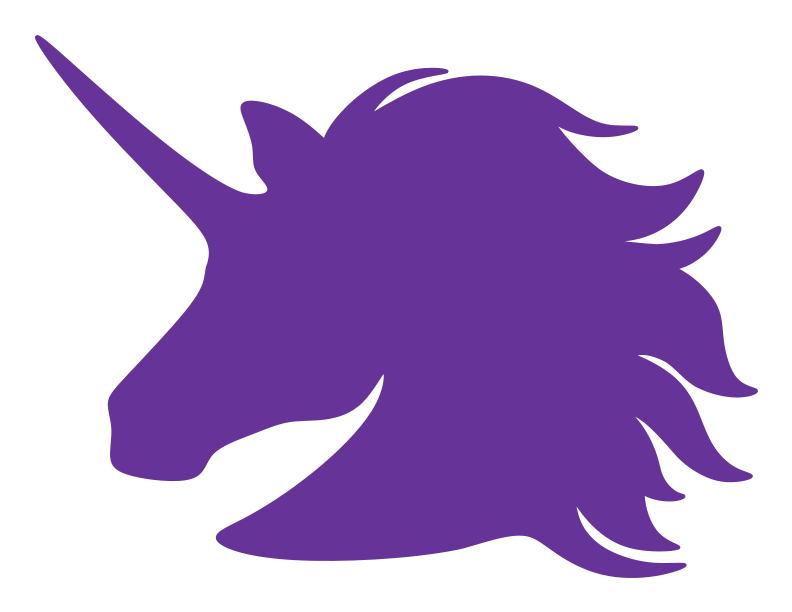

A tab component which creates all of HTML, takes all data from JSON object and where a user can create new tabs. It can display large amount of tabs, when there is not enough space, a user can scroll through tabs.

# How it looks like:

### Without styling:
- Just add (or copy) styles.css file


### With styling:
- Add (or copy) both styles.css file and pretty-styles.css. Form styling is also in this file.


# How to use:

### For tab:

The component needs just an element with id of "tabs" for basic tabs without styling. Rest of HTML will be generated by the component.
For tab with styling you need to wrap tabs element by another element with "tab-wrapper" class:
```
<div class="tab-wrapper">
  <div id="tabs">
    
  </div>
</div>
```

### For form:
You need to push form values to tabData. Each tab should have `tabButton`, `tabTitle` and `tabText`.
Also call `unicornTabs.newTab();` to print it and `let unicornTabs = new UnicornTabs();` to instantiate it.

Example of form needed:
```
let unicornTabs = new UnicornTabs();

    function newTabFormData(e) {
        e.preventDefault();

        let newTabButtonValue = document.getElementById('newTabButton').value;
        let newTabTitleValue = document.getElementById('newTabTitle').value;
        let newTabTextValue = document.getElementById('newTabText').value;
		
        var addNewTab = {"tabButton":newTabButtonValue, "tabTitle":newTabTitleValue, "tabText":newTabTextValue}
        tabData.push(addNewTab);


        unicornTabs.newTab();
        alert("New tab have been added");
    }

    form.addEventListener('submit', newTabFormData);
